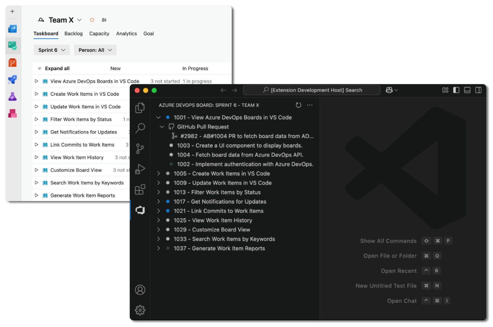

# Azure DevOps Boards

This extension provides a tree view panel for the Azure DevOps Boards within Visual Studio Code.

## Features

- View and manage work items on the ADO Sprint board.
- List GitHub pull requests that are linked to the work items.
- Preview work item details and comments directly in the VS Code editor.
- Append work item titles for `AB#` links in GitHub pull request descriptions. ([Link GitHub pull requests to work items in Azure Boards](https://learn.microsoft.com/en-us/azure/devops/boards/github/link-to-from-github?view=azure-devops#use-ab-to-link-from-github-to-azure-boards-work-items))
- Trigger webhooks on work item state changes and pull request updates. The webhook is triggered locally without requiring admin access.

## Extension Settings

- **(Required)** `adoBoards.adoPersonalAccessToken`: [ADO Personal Access Token](https://learn.microsoft.com/en-us/azure/devops/organizations/accounts/use-personal-access-tokens-to-authenticate)
  - Required access scopes:
    - User Profile (Read)
    - Project and Team (Read)
    - Work Items (Read & write)
  - Full access is required to display the GitHub pull request list due to the use of an [undocumented API](https://github.com/ztt25/azure-devops-boards-vscode/blob/main/src/utils/getGitHubArtifact.ts).
- **(Required)** `adoBoards.serverUrl`: Usually in this format `https://dev.azure.com/{organization}`.
- **(Required)** `adoBoards.projectId`: Your project id.

## Feedback

This extension is currently an MVP version. If you have any suggestions or find any bugs, please feel free to submit an issue.
